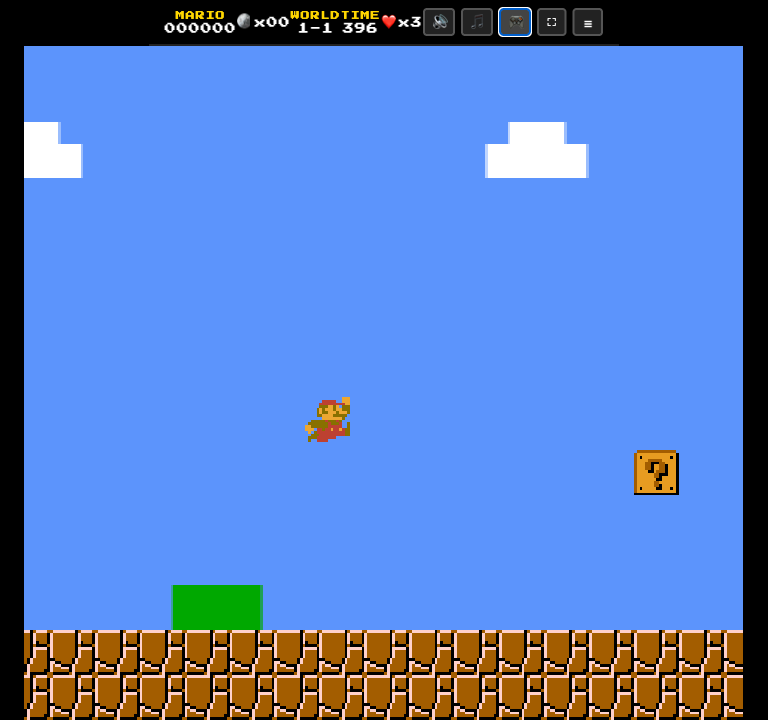

# Super Mario — Angular 22 Signals Edition

A complete, retro-authentic **Super Mario Bros** game built with **Angular 22**, pure **Angular Signals**, and zoneless change detection (`provideZonelessChangeDetection()`).

<p align="center">
  
</p>

---

## Features

- **Angular 22 Zoneless Architecture**: Powered by `provideZonelessChangeDetection()` and pure Signal-driven state management for 60 FPS performance with zero Zone.js overhead.
- **Deterministic 2D Canvas Physics Engine**: Authentic NES physics simulation with Mario momentum, acceleration, skidding friction, variable jump height, and tile collisions.
- **Native Chiptune Synthesizer**: Web Audio API oscillator synthesis generating 8-bit NES sound effects and background melodies (Overworld, Underground, Castle, Starman) with zero external audio assets.
- **4 Playable Worlds**:
  - **World 1-1**: Classic Grassy Overworld with pipes, Goombas, Koopas, and Flagpole castle.
  - **World 1-2**: Underground Cavern with blue brick ceilings and secret coin caches.
  - **World 1-3**: Athletic Treetops with mushroom platforming and high gaps.
  - **World 1-4**: Bowser's Castle featuring lava pits, Bowser fire-breath boss fight, and the golden Axe bridge collapse.
- **In-Game Level Builder**: Interactive sandbox editor to draw custom tilemaps, place enemies/items, and test-play immediately.
- **Responsive Retro Controls**: Full keyboard support and on-screen virtual gamepad (D-Pad + A/B action buttons) for touch & mobile devices.

---

## Controls

| Action | Keyboard | Virtual Gamepad (Touch / Mouse) |
| :--- | :--- | :--- |
| **Move Left / Right** | `←` `→` / `A`, `D` | Virtual D-Pad Left / Right |
| **Crouch / Enter Pipe** | `↓` / `S` | Virtual D-Pad Down |
| **Jump** | `Z` / `Space` | **A** Button |
| **Sprint / Shoot Fireball** | `X` / `Shift` | **B** Button |
| **Pause** | `P` / `Esc` | HUD Menu Button (`☰`) |
| **Toggle Sound** | `🔊` / `🔇` | Master Mute / Unmute |
| **Toggle Music** | `🎵` / `⏹️` | BGM Mute / Unmute |
| **Toggle Gamepad** | `🎮` | Show / Hide Virtual Gamepad |
| **Fullscreen** | `⛶` | Enter / Exit Fullscreen |

---

## Getting Started

### Prerequisites
- Node.js (v18+)
- npm

### Installation & Development Server

```bash
# Clone the repository
git clone git@github.com:sd-dweb/ng-mario.git
cd ng-mario

# Install dependencies
npm install

# Start development server
npm start
```

Open `http://localhost:4200` in your browser.

### Production Build

```bash
npm run build
```

The optimized build artifacts will be generated in the `dist/ng-mario` directory.

